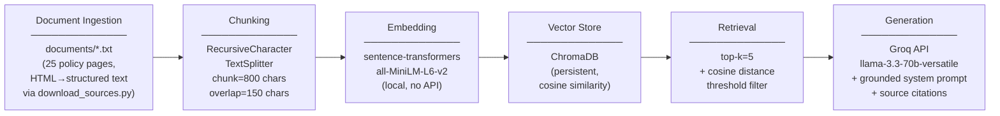

# Project 1 Planning: The Unofficial Guide

> Write this document before you write any pipeline code.
> Your spec and architecture diagram are what you'll use to direct AI tools (Claude, Copilot, etc.) to generate your implementation — the more specific they are, the more useful the generated code will be.
> Update the Retrieval Approach and Chunking Strategy sections if you change your approach during implementation.
> Update this file before starting any stretch features.

---

## Domain

**Domain:** Policies & Regulations relevant to international students on a F1 Visa (the most common student visa type) at Georgia Tech.

---

## Documents

All sources are from policy documents provided by the Georgia Institute of Technology's Office of International Education, International Student & Scholar Services. (Link: https://isss.oie.gatech.edu/ISSS_F_Current)

Wrote a simple python script (`download_sources.py`) to scrape each website, and download only the policy text (avoiding links, banners, and other elements on the website that could add junk data). 

Additionally, to aid with the recursive chunking strategy we implement later, we went beyond simply copying the website text (which in testing resulted in broken sentences and overall messy formatting that would be problematic for any chunking strategy). Instead, the script walks the HTML tree tag-by-tag and converts each element into structured plain text similar to markdown: headings (`<h1>`–`<h6>`) become `# Heading` lines surrounded by blank lines, paragraphs (`
`) are separated by double newlines, list items (`<ul>`/`<ol>`) are rendered as `- item` or `1. item` lines, and tables are flattened into pipe-separated rows. Navigation elements, banners, scripts, and footers are stripped entirely. 

The result is a document where every natural section boundary is marked by a `\n\n`, which is exactly the delimiter that `RecursiveCharacterTextSplitter` tries first — meaning the chunker will respect paragraph and heading structure before ever splitting mid-sentence.

| # | Source | Type | URL or file path |
|---|--------|------|-----------------|
| 1 | Regulations Overview | Webpage | https://isss.oie.gatech.edu/node/4097 |
| 2 | F Immigration Document Overview | Webpage | https://isss.oie.gatech.edu/node/4098 |
| 3 | Enrollment Requirements | Webpage | https://isss.oie.gatech.edu/node/4100 |
| 4 | Understanding Your I-20/DS-2019 | Webpage | https://isss.oie.gatech.edu/understanding-your-i-20ds-2019 |
| 5 | I-20 Updates: Keeping your I-20 Up-To-Date | Webpage | https://isss.oie.gatech.edu/node/3431 |
| 6 | Digitally-signed I-20 Form Guidance | Webpage | https://isss.oie.gatech.edu/content/digitally-signed-i-20-form-guidance |
| 7 | Travel | Webpage | https://isss.oie.gatech.edu/node/4099 |
| 8 | Renewing Your Visa | Webpage | https://isss.oie.gatech.edu/node/2794 |
| 9 | Taxes for Non-Residents | Webpage | https://isss.oie.gatech.edu/node/181 |
| 10 | Change of Status to F-1 | Webpage | https://isss.oie.gatech.edu/content/change-visa-status-f-1 |
| 11 | Transfer SEVIS Record to Another U.S. Institution | Webpage | https://isss.oie.gatech.edu/node/4095 |
| 12 | Change of Status From F-1 | Webpage | https://isss.oie.gatech.edu/node/4096 |
| 13 | Out of Status Options | Webpage | https://isss.oie.gatech.edu/node/3967 |
| 14 | Social Security Numbers | Webpage | https://isss.oie.gatech.edu/node/3399 |
| 15 | F-1 Employment Overview | Webpage | https://isss.oie.gatech.edu/node/3143 |
| 16 | Practical Training Fee | Webpage | https://isss.oie.gatech.edu/isss/ptf |
| 17 | Curricular Practical Training (CPT) | Webpage | https://isss.oie.gatech.edu/content/curricular-practical-training-cpt-georgia-tech |
| 18 | Optional Practical Training (OPT) | Webpage | https://isss.oie.gatech.edu/node/3142 |
| 19 | OPT Workshop | Webpage | https://isss.oie.gatech.edu/isss/opt |
| 20 | OPT Employment Types and Requirements | Webpage | https://isss.oie.gatech.edu/isss/types-work-constitute-employment-opt-evidence-employment |
| 21 | OPT Frequently Asked Questions | Webpage | https://isss.oie.gatech.edu/node/3456 |
| 22 | OPT and Traveling Abroad | Webpage | https://isss.oie.gatech.edu/node/3622 |
| 23 | STEM OPT Extension | Webpage | https://isss.oie.gatech.edu/content/stem-opt-extension |
| 24 | H1B Cap-Gap Extension | Webpage | https://isss.oie.gatech.edu/node/3864 |
| 25 | Professional Development | Webpage | https://isss.oie.gatech.edu/professional-development |

---

## Chunking Strategy

**Chunk size:** 800 characters (ceiling, chunks may be shorter if a natural boundary falls earlier)

**Overlap:** 150 characters

**Reasoning:**: A recursive character splitting strategy was used rather than a fixed-length strategy. More specifically, the chunker should first attempt to split on double newlines (`\n\n`), which correspond directly to the heading and paragraph boundaries encoded during the HTML-to-text conversion step. It only falls back to single newlines (list items), then sentence endings, then word boundaries if a block still exceeds 800 characters. This means a self-contained policy paragraph or FAQ answer is kept as a single chunk whenever possible, rather than being cut mid-rule.

The 800-character ceiling was chosen because the source documents consist of policy paragraphs and FAQ entries that average 400–900 characters each. A 800 character celing is large enough to hold a complete rule with its conditions. The 150-character overlap prevents a condition stated at the end of one chunk from being severed from the consequence that starts the next (e.g., "students authorized for more than 364 days of full-time CPT are no longer eligible for OPT" spanning a boundary).

Preprocessing before chunking: the HTML-to-structured-text conversion (described in the Document Sources section above) was the primary preprocessing step. Each document also retains a `Source:` and `URL:` header that is prepended to every chunk at ingest time, ensuring every retrieved chunk carries its own citation regardless of where it lands after splitting.

---

## Retrieval Approach

<!-- Which embedding model are you using (e.g., all-MiniLM-L6-v2 via sentence-transformers)?
     How many chunks will you retrieve per query (top-k)?
     If you were deploying this for real users and cost wasn't a constraint, what tradeoffs
     would you weigh in choosing a different embedding model — context length, multilingual
     support, accuracy on domain-specific text, latency? -->

**Embedding model:** `all-MiniLM-L6-v2`
- very lightweight
- low context window (256 tokens), but perfect for 800 character chunk size

**Top-k:** 10, but with cosine distance filter afterwards.
- Chose a pretty generous top-k because student-visa related policy questions often cross multiple topics / policies. (ex: `Can I work on CPT for 2 years and apply for OPT later?` would require knowledge about different topics including CPT, OPT, post-completion OPT, and STEM OPT extension)

**Production tradeoff reflection:**
Without practical constraints, I would change my approach based on these considerations:
- Domain Knowledge: A model fine tuned on legal / policy documents would result in more accurate embeddings. A general purpose model would not know, for instance, that "SEVIS", "DSO", and "I-20" are semantically close terms in a immigration context
- Multilingual: I would also consider adding multilingual prompt support to allow users to prompt in their native languages. A multilingual model such as `multilingual-e5-large` would allow users to do so

---

## Evaluation Plan

<!-- List your 5 test questions with their expected correct answers.
     Questions should be specific enough that you can judge whether the system's response
     is right or wrong. "What are good dining halls?" is too vague.
     "What do students say about wait times at [dining hall name] during lunch?" is testable. -->

| # | Question | Expected answer |
|---|----------|-----------------|
| 1 | I am an international student on a F1 visa. I worked for 400 days on full-time CPT. Am I eligible for OPT after graduation? | No, since you participated in more than 364 days of full-time CPT, you are not eligible for OPT. |
| 2 | I worked for 4 academic semesters on part-time CPT, and 2 summers on full-time CPT (around 3 months each). Am I all good for OPT after graduation? | Yes, part-time CPT does not count towards your CPT limit. You completed around 6 months of full-time CPT, which should be well under the 364 day limit that would make you inelligible for OPT. |
| 3 | I'm a F1 student who recently began work on-campus as a student employee. Do I need an SSN? How do I get one? | You don't need one under federal law, but GTHR requires you to obtain one and provide it within 90 days of your start date. [instructions to get one] |
| 4 | I'm on post-completion OPT and my F-1 visa stamp expired. I want to visit my family abroad for 3 weeks and come back. What do I need to do before re-entering the U.S.? | You must obtain a new F-1 visa stamp at a U.S. Embassy or Consulate abroad before attempting to re-enter the U.S. — an expired visa stamp is not valid for re-entry even while on OPT. The one exception is Automatic Visa Revalidation, which allows re-entry with an expired visa only if you visited Canada, Mexico, or adjacent islands (excluding Cuba) for fewer than 30 days total and did not apply for a new visa during that trip. |
| 5 | I'm an F-1 student and my doctor has recommended I take a lighter course load this semester for medical reasons. Can I drop below 12 credit hours, and if so, what is the minimum I can take? | Yes, you may apply for a Medical Reduced Course Load (RCL). You must submit documentation from a licensed medical professional and receive OIE approval *before* dropping below full-time. With medical RCL approval, you can reduce enrollment to as few as 0 credits. You cannot drop below full-time before receiving the approval or you will be considered out of status. |

---

## Anticipated Challenges

<!-- What could go wrong? Name at least two specific risks with reasoning.
     Consider: noisy or inconsistent documents, missing source attribution, off-topic
     retrieval, chunks that split key information across boundaries. -->

1. Many pages cross-reference each other without repeating the content.
Phrases like "see OIE's Travel Guidance Website" or "review our STEM OPT guidance page" appear frequently. When those references land in a retrieved chunk, the LLM sees an instruction to look elsewhere but the referenced content is not in the context window. The model may either hallucinate what the linked page says or give an incomplete answer, neither of which is obvious to the user.

2. Student questions are often colloquial & casual while documents are formal and bureaucratic.
A student asking "am i good to start interning before CPT approved?" maps poorly to document text in formal language like "F-1 students must receive approval for their CPT authorization from OIE before starting their employment." The embedding distance between casual phrasing and regulatory language may be high enough that the correct chunk doesn't surface within the cosine threshold, even though the answer is present.

---

## Architecture

---

## AI Tool Plan

<!-- For each part of the pipeline below, describe:
     - Which AI tool you plan to use (Claude, Copilot, ChatGPT, etc.)
     - What you'll give it as input (which sections of this planning.md, which requirements)
     - What you expect it to produce
     - How you'll verify the output matches your spec

     "I'll use AI to help me code" is not a plan.
     "I'll give Claude my Chunking Strategy section and ask it to implement chunk_text()
     with my specified chunk size and overlap" is a plan. -->

**Milestone 3 — Ingestion and chunking:**
- **Tool:** Claude Sonnet 4.6 (High) through GitHub Copilot (in VS Code agent mode)
- **Input:** The Chunking Strategy section of this planning.md (chunk size, overlap, separator hierarchy, preprocessing notes)
- **Expected output:** An `ingest.py` that loads all `.txt` files from `documents/`, prepends the `Source:` / `URL:` header to every chunk, splits using `RecursiveCharacterTextSplitter(chunk_size=800, chunk_overlap=150, separators=["\n\n", "\n", ". ", " "])`, and upserts chunks into a persistent ChromaDB collection
- **Verification:** Run `ingest.py`, check that ChromaDB collection count matches expected chunk count; manually inspect 3–5 chunks from different files to confirm source headers are present and no chunk is truncated mid-sentence

**Milestone 4 — Embedding and retrieval:**
- **Tool:** Claude Sonnet 4.6 (High) through GitHub Copilot (in VS Code agent mode)
- **Input:** The Retrieval Approach section of this planning.md (model name, top-k=5, cosine distance filter)
- **Expected output:** A `retriever.py` with a `retrieve(query: str) -> list[dict]` function that embeds the query with `all-MiniLM-L6-v2`, queries ChromaDB for top-5 results, filters out chunks whose cosine distance exceeds the threshold, and returns a list of `{text, source, url, distance}` dicts
- **Verification:** Run each of the 5 evaluation plan questions through `retriever.py` and manually check that the returned chunks contain the information needed to answer the question; flag any question where the correct source document does not appear in the top-5

**Milestone 5 — Generation and interface:**
- **Tool:** Claude Sonnet 4.6 (High) through GitHub Copilot (in VS Code agent mode)
- **Input:** The Architecture diagram + the Grounded Generation section of README.md (system prompt design, citation format)
- **Expected output:** A `generator.py` that formats retrieved chunks into a context block (with source/URL per chunk), calls the Groq API with a system prompt that instructs the model to answer only from the provided context and cite sources by name, and a `app.py` Gradio interface that wires the retriever and generator together with a chat input
- **Verification:** Run all 5 evaluation plan questions end-to-end; confirm the response cites a real source URL for every claim, and that the system refuses to answer out-of-scope questions (e.g., "What is the capital of France?") rather than hallucinating
